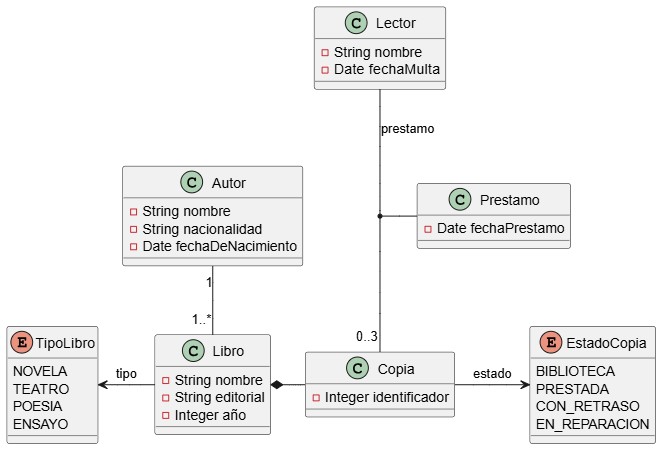

# Proyecto de ejemplo de Maven

## Proyecto: Gestion de biblioteca

- Una **biblioteca** tiene **copias** de **libros**. Estos últimos se caracterizan por su **nombre**, **tipo**(novela, teatro, poesia, ensayo), **editorial**, **año** y **autor**.
- Los **autores** se **caracterizan** por su **nombre**, **nacionalidad** y **fecha de nacimiento**.
- Cada **copia** tiene un **identificador**, y puede estar en la **biblioteca**, **prestada** **con retraso** o **en reparacion**.
- Los **lectores** pueden tener un maximo de 3 **libros** en **préstamo**.
- Cada **libro** se presta un máximo de 30 días, por cada dia de retraso, se _impone_ una **multa** de dos días sin posibilidades de _pedir_ un nuevo libro.

Realiza un diagrama de clases y añade los métodos necesarios para realizar el préstamo y devolución de libros. 

## Modelo de datos

